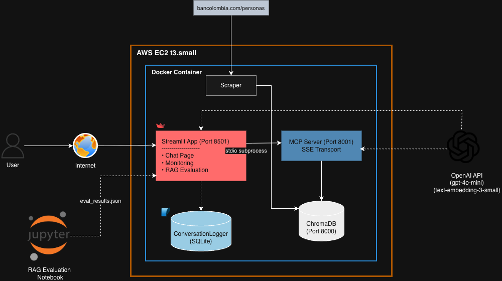

# 🏦 Bancolombia RAG Assistant

<!-- Badges -->
[](https://github.com/lasanchezgi/bancolombia-rag/actions/workflows/ci.yml)


---

## Descripción

Asistente virtual conversacional sobre productos y servicios de
Bancolombia para personas naturales. Construido como sistema RAG
(Retrieval-Augmented Generation) end-to-end: desde el scraping
del sitio web oficial hasta una interfaz de chat que responde
preguntas en lenguaje natural citando las fuentes consultadas.

El sistema expone su base de conocimiento como un servidor MCP
(Model Context Protocol), lo que lo hace reutilizable por
cualquier cliente MCP compatible — incluyendo Claude Desktop.

---

## Arquitectura



### Flujo de datos end-to-end

1. **Scraper** — descarga `sitemap-personas.xml` (473 URLs
   permitidas por robots.txt), filtra rutas prohibidas y
   descarga el contenido con `httpx` + `BeautifulSoup`
2. **Pipeline** — limpia el HTML, aplica chunking recursivo
   (500 palabras, 50 de overlap) y genera embeddings con
   `text-embedding-3-small` de OpenAI
3. **ChromaDB** — almacena 142 chunks con metadata completa:
   url, title, category, subcategory, extraction_date
4. **MCP Server** — expone 3 tools y 1 resource via FastMCP
   con transporte stdio (obligatorio) y SSE (externo)
5. **RAGAgent** — agentic loop con `gpt-4o-mini`, 3 tipos de
   memoria, cliente MCP via subprocess stdio, y Cross-Encoder
   reranking de los candidatos recuperados
6. **Streamlit** — interfaz de chat con citación de fuentes,
   historial y sidebar informativo; más dos páginas protegidas:
   **Monitoreo** (métricas operacionales, trazabilidad MCP,
   gaps de KB) y **Evaluación** (faithfulness + factualidad)

---

## Stack tecnológico

| Componente | Tecnología | Justificación |
|---|---|---|
| Lenguaje | Python 3.12 | Ecosistema ML/AI más maduro |
| Gestor de deps | uv | Más rápido que pip/poetry, lock file nativo |
| Scraping | httpx + BeautifulSoup | Sitio server-side rendered, no requiere JS |
| Embeddings | text-embedding-3-small | Mejor calidad/costo en español, 1536d |
| Reranking | cross-encoder/ms-marco-MiniLM-L-6-v2 | Reordena candidatos ChromaDB por relevancia real, 22 MB local |
| Vector DB | ChromaDB 0.6.3 self-hosted | Sin costo para evaluador, modo dual local/http |
| MCP Server | FastMCP 3.2 | SDK oficial Python para MCP, stdio + SSE |
| LLM | gpt-4o-mini | Rápido, económico, calidad suficiente |
| Agente | OpenAI SDK nativo | Sin frameworks, loop transparente y explicable |
| Logging | SQLite (`ConversationLogger`) | Persistencia de conversaciones sin servicios externos |
| Frontend | Streamlit multi-page | Chat + Monitoreo + Evaluación en un mismo proceso |
| CI/CD | GitHub Actions | Integrado con el repo, gratuito |
| Contenedores | Docker + Compose | Despliegue reproducible en EC2 |

---

## Instalación

### Prerequisitos

- Python 3.12+
- [uv](https://docs.astral.sh/uv/) — gestor de dependencias
- Docker + Docker Compose
- API key de OpenAI

### Setup local

```bash
git clone https://github.com/lasanchezgi/bancolombia-rag
cd bancolombia-rag
cp .env.example .env
# Editar .env con tu OPENAI_API_KEY
uv sync
```

### Poblar la base de conocimiento (one-time)

```bash
# 1. Scrapear el sitio de Bancolombia
uv run python scripts/run_scraper.py

# 2. Limpiar, chunkear e indexar en ChromaDB
uv run python scripts/run_pipeline.py
```

### Ejecutar el asistente

```bash
uv run streamlit run src/frontend/app.py
# Abrir: http://localhost:8501
```

---

## Variables de entorno

| Variable | Descripción | Default |
|---|---|---|
| `OPENAI_API_KEY` | API key de OpenAI | requerida |
| `CHROMA_HOST` | Host de ChromaDB (`local` para desarrollo) | `local` |
| `CHROMA_PORT` | Puerto de ChromaDB | `8000` |
| `CHROMA_COLLECTION` | Nombre de la colección | `bancolombia_kb` |
| `MCP_SERVER_HOST` | Host del servidor MCP (SSE) | `0.0.0.0` |
| `MCP_SERVER_PORT` | Puerto del servidor MCP (SSE) | `8000` |
| `MCP_TRANSPORT` | Transporte MCP: `stdio` o `sse` | `stdio` |
| `MCP_SERVER_SCRIPT` | Path al script del servidor MCP | `src/mcp_server/server.py` |
| `BANCOLOMBIA_BASE_URL` | URL base para scraping | `https://www.bancolombia.com/personas` |
| `MAX_PAGES` | Máximo de páginas a scrapear | `80` |
| `CHUNK_SIZE` | Tamaño de chunk en palabras | `500` |
| `CHUNK_OVERLAP` | Overlap entre chunks en palabras | `50` |
| `MONITORING_PASSWORD` | Contraseña del dashboard de monitoreo y evaluación | `bancolombia2026` |
| `CONVERSATIONS_DB_PATH` | Path al SQLite de conversaciones | `data/conversations.db` |

---

## Docker

### Ejecutar con Docker Compose

> **Importante:** antes de correr `docker compose up`,
> asegúrate de que el archivo `.env` existe en la raíz
> del proyecto con todas las variables configuradas.

```bash
# Levantar ChromaDB + frontend
docker-compose up -d

# Acceder en: http://localhost:8501
```

### Poblar la base de conocimiento en Docker

```bash
# Scrapear (requiere datos/raw/ vacío)
docker-compose --profile tools up scraper

# Indexar en ChromaDB
docker-compose --profile tools up pipeline
```

### Arquitectura de contenedores

```text
docker-compose
├── chromadb     — base vectorial persistida en volumen
│                  (healthcheck: GET /api/v1/heartbeat)
└── frontend     — Streamlit + RAGAgent + MCP Server
    ├── /          Chat principal
    ├── /Monitoreo  Dashboard operacional (requiere MONITORING_PASSWORD)
    └── /Evaluacion Métricas faithfulness y factualidad
                  (el MCP Server corre como subprocess stdio
                   dentro del contenedor frontend)
```

> **Nota arquitectural:** el servidor MCP no es un contenedor
> separado. El agente lo lanza como proceso hijo via stdio —
> que es exactamente cómo funciona el transporte stdio de MCP.
> Para consumo externo (Claude Desktop, otros clientes MCP),
> el servidor también expone transporte SSE en el puerto 8000.

---

## Decisiones técnicas

### 1. Scraping: sitemap-driven en vez de link crawling

El sitio `bancolombia.com` expone `sitemap-personas.xml` con
473 URLs estructuradas y `priority: 1.0`. Usar el sitemap en
lugar de crawlear links es más eficiente, más respetuoso con
el servidor y produce una cobertura más predecible.

El `robots.txt` del sitio autoriza explícitamente a `ClaudeBot`
y `Claude-User`. Las rutas prohibidas (formularios,
preaprobados, páginas de test) se filtran antes del crawl.

### 2. Chunking: RecursiveCharacterTextSplitter manual

Estrategia de segmentación recursiva con separadores en orden
de preferencia: `\n\n → \n → ". " → " "`. Tamaño de 500
palabras con 50 de overlap.

Este tamaño balancea contexto suficiente para responder
preguntas (no demasiado pequeño) con precisión de recuperación
semántica (no demasiado grande). El overlap evita cortar
información relevante en los bordes de los chunks.

### 3. Embeddings: text-embedding-3-small

Elegido sobre `sentence-transformers` local (peor calidad en
español) y `text-embedding-3-large` (3x más costoso, dimensión
3072 vs 1536 sin mejora proporcional para este corpus).
Costo real del pipeline completo: menos de $0.01 USD.

### 4. Vector DB: ChromaDB self-hosted

ChromaDB en modo `PersistentClient` local para desarrollo y
`HttpClient` para Docker. El evaluador no necesita cuenta en
ningún servicio externo. Upsert en vez de add para idempotencia
— el pipeline se puede correr múltiples veces sin duplicar.

### 5. MCP Server: proceso hijo via stdio

El servidor MCP corre como subprocess del agente con transporte
stdio. Esto es correcto según la especificación MCP: stdio es
el transporte estándar para comunicación local.

Adicionalmente se implementó SSE para consumo externo —
cualquier cliente MCP compatible (Claude Desktop, otros agentes)
puede conectarse al servidor directamente con:

```json
{"url": "http://tu-servidor:8000/sse"}
```

### 6. Agente: OpenAI SDK nativo sin frameworks

El agentic loop está implementado directamente sobre el SDK de
OpenAI sin LangChain ni LangGraph. Esto hace que cada decisión
del agente sea completamente transparente y explicable:

```python
while True:
    response = openai.chat(messages, tools)
    if tool_calls:  # ejecutar via MCP → agregar al historial
        ...
    if stop:  # retornar respuesta final
        ...
```

Ventaja: el código es más corto, más fácil de depurar y el
candidato puede explicar cada línea en la entrevista técnica.

### 7. Memoria: tres capas

| Tipo | Implementación | Propósito |
|---|---|---|
| Corto plazo | `ShortTermMemory` — ventana de 20 mensajes | Conversación activa |
| Mediano plazo | `MidTermMemory` — resumen automático a 15+ msgs | Contexto sin saturar la ventana |
| Largo plazo | `LongTermMemory` — JSON persistido en `.memory/` | Preferencias entre sesiones |

### 8. Reranking: Cross-Encoder sobre candidatos bi-encoder

Después de recuperar los top-k chunks por similitud coseno en
ChromaDB, un Cross-Encoder (`cross-encoder/ms-marco-MiniLM-L-6-v2`,
22 MB) reordena los resultados por relevancia real al query.
El bi-encoder es eficiente pero puede rankear incorrectamente
chunks con alta similitud léxica y baja relevancia semántica.
El reranker añade ~200 ms de latencia a cambio de respuestas
más precisas. Se recuperan `top_k * 3` candidatos y se
devuelven los mejores `top_k` tras el reranking.

### 9. Observabilidad: logging SQLite + dashboard Streamlit

`ConversationLogger` (`src/agent/conversation_logger.py`)
persiste cada interacción en `data/conversations.db` (SQLite):
pregunta, respuesta, herramientas MCP usadas, scores de
retrieval y latencia. El dashboard de monitoreo
(`pages/monitoring.py`) consume estas tablas para mostrar
métricas en tiempo real, trazabilidad granular de llamadas MCP
y gaps de la base de conocimiento. Acceso protegido con
`MONITORING_PASSWORD`.

### 10. Evaluación formal: LLM-as-a-judge

El notebook `notebooks/rag_evaluation.ipynb` evalúa el sistema
con 20 preguntas representativas y dos métricas:
**faithfulness** (afirmaciones verificables en los chunks
recuperados) y **factuality** (corrección vs respuestas de
referencia). Cada pregunta se evalúa con y sin reranking para
cuantificar el impacto. Los resultados se persisten en
`data/eval_results.json` y se visualizan en
`pages/evaluation.py`.

---

## Limitaciones conocidas

- El scraper cubre las primeras 80 URLs del sitemap
  (de 473 disponibles). Escalar es trivial: `MAX_PAGES=473`
- El contenido no se actualiza automáticamente; requiere
  re-ejecutar el scraper y pipeline manualmente
- La página del simulador de tarjeta de crédito es dinámica
  (JavaScript puro) y fue descartada por contenido vacío
- `LongTermMemory` persiste en disco local; en producción
  debería migrarse a Redis o DynamoDB
- El tiempo de respuesta del agente es de 8-15 segundos
  por la cadena: embedding → ChromaDB → MCP → OpenAI

---

## Tests y CI/CD

```bash
# Correr todos los tests
uv run pytest tests/ -v

# Linting
uv run ruff check src/ tests/

# Formateo
uv run black --check src/ tests/
```

GitHub Actions corre automáticamente en cada push a `main`:
`ruff → black → pytest (126 tests)`

---

## Estructura del proyecto

```text
bancolombia-rag/
├── src/
│   ├── scraper/          # Crawler, parser y storage
│   ├── pipeline/         # Cleaner y chunker
│   ├── embeddings/       # Embedder con OpenAI + Reranker (cross-encoder)
│   ├── vector_store/     # ABC + ChromaDB adapter
│   ├── mcp_server/       # FastMCP server + tools
│   ├── agent/            # RAGAgent + memoria + prompts + ConversationLogger
│   └── frontend/
│       ├── app.py        # Chat principal
│       └── pages/
│           ├── monitoring.py   # Dashboard operacional (protegido)
│           └── evaluation.py  # Métricas faithfulness/factualidad (protegido)
├── notebooks/
│   └── rag_evaluation.ipynb   # Pipeline de evaluación formal
├── tests/                # 126 tests unitarios
├── scripts/              # run_scraper.py, run_pipeline.py
├── data/
│   ├── eval_results.json # Resultados de evaluación (estático, en imagen Docker)
│   └── raw/              # JSONs scrapeados (gitignored)
├── .github/workflows/    # ci.yml
├── .dockerignore
├── Dockerfile
├── docker-compose.yml
├── pyproject.toml
└── .env.example
```

---

## Deploy

Para desplegar cambios en producción:

1. Configura las variables en `.env`:

   ```bash
   DOCKER_IMAGE=lasanchezgi/bancolombia-rag:latest
   EC2_HOST=98.81.30.8
   EC2_USER=ec2-user
   EC2_KEY_PATH=~/Downloads/bancolombia-rag-key.pem
   ```

2. Corre el script:

   ```bash
   ./scripts/deploy.sh
   ```

El script construye la imagen multi-arch (`linux/amd64` + `linux/arm64`),
la sube a Docker Hub y despliega automáticamente en EC2 (pull + up + pipeline).

> **Nota:** el `.pem` nunca va al repositorio. Se referencia por path local.
> El `git push` sigue siendo manual y deliberado.

---

## App desplegada

🤖 [Asistente Bancolombia](http://98.81.30.8:8501/)

---

## Video demo

🎬 [Ver demo](https://drive.google.com/file/d/1Qr038D57rEHv2Snk7_CD31gHeuEhfaNf/view?usp=sharing)

---

## Autor

**Laura Sánchez** · [@lasanchezgi](https://github.com/lasanchezgi)
